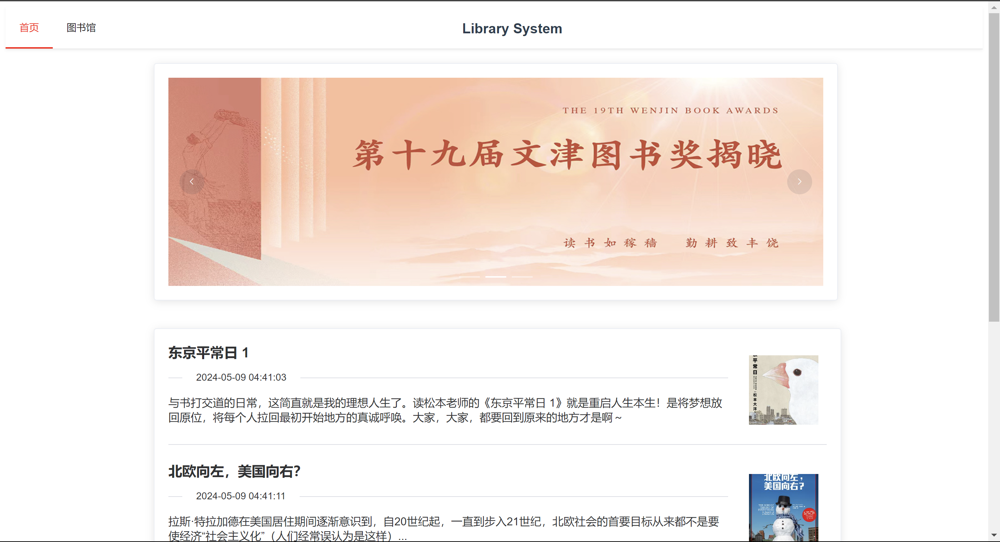
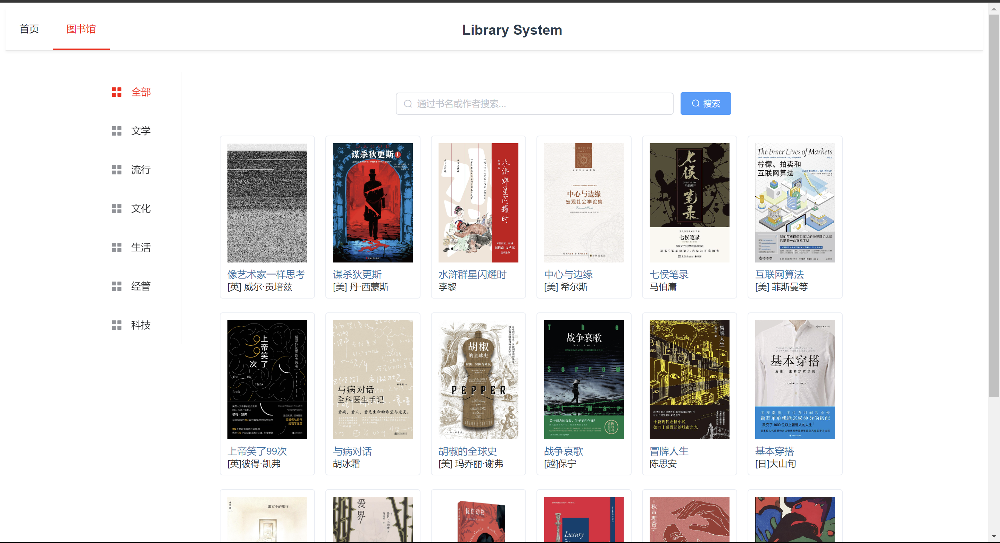
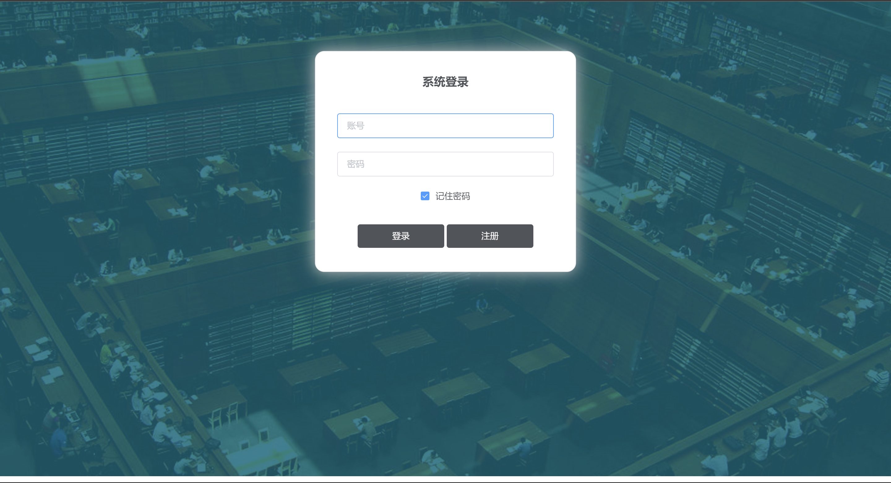
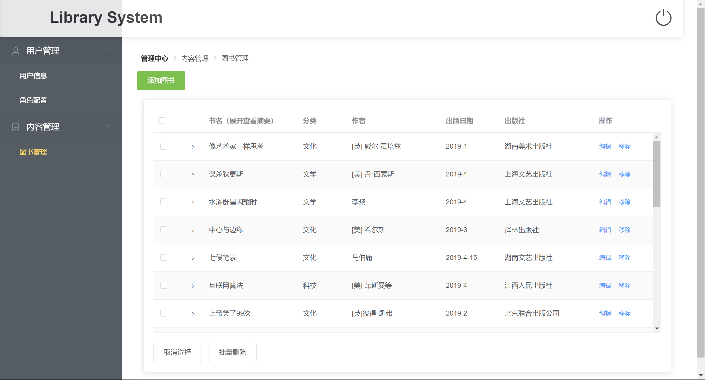

# ls_vue

> 图书陈列系统，包含前后台，是一个前后端分离项目。前端选用Vue2+Vuex+Element UI，后端SpringBoot+Shiro+Spring Data JPA，数据库为MySQL。
>
> 后端地址：https://github.com/liuyq1243/librarysystem.git

## 环境

node v12.22.12

npm 6.14.16

安装node-sass时需要注意设置sass_binary_site = "https://cdn.npmmirror.com/binaries/node-sass"

## 运行截图

前台





后台访问`/admin`



根据当前角色实现动态路由



## Build Setup

``` bash
# install dependencies
npm install

# serve with hot reload at localhost:8080
npm run dev

# build for production with minification
npm run build

# build for production and view the bundle analyzer report
npm run build --report
```

For a detailed explanation on how things work, check out the [guide](http://vuejs-templates.github.io/webpack/) and [docs for vue-loader](http://vuejs.github.io/vue-loader).
